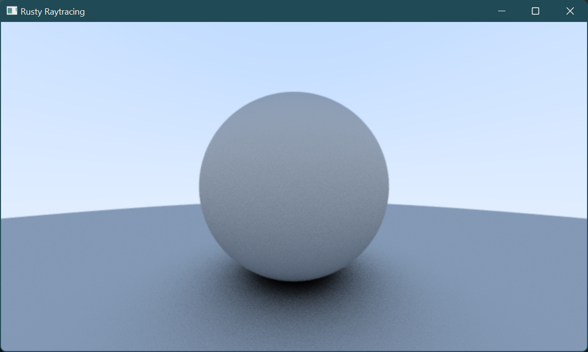
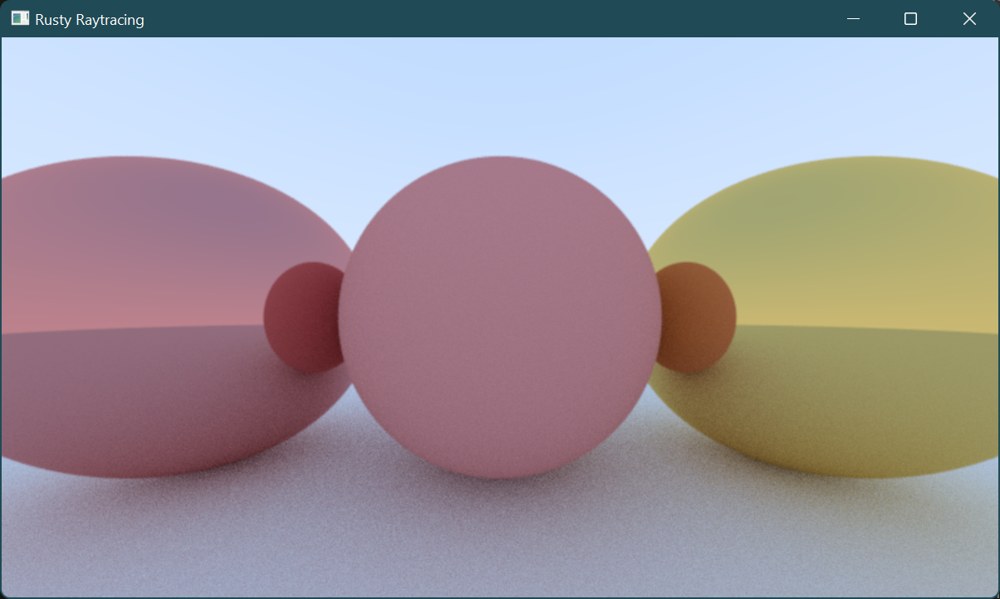
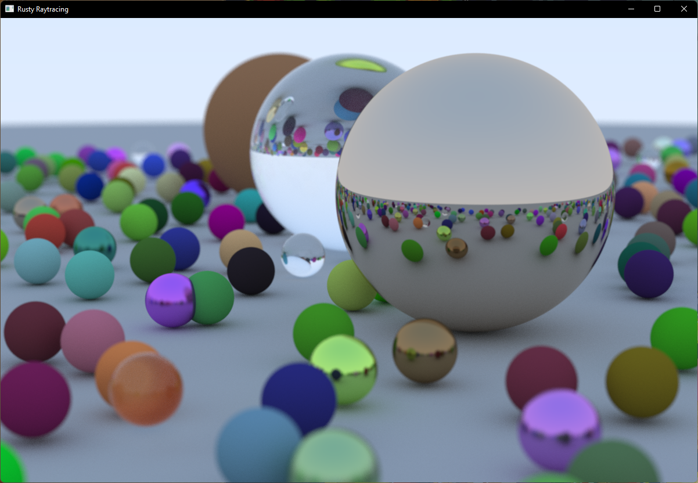

# rusty-raytracing-weekend

Following [_Ray Tracing in One Weekend_](https://raytracing.github.io/books/RayTracingInOneWeekend.html)

Goals
- Idiomatic Rust
- Functional Style
- Find out what happens if you're inside a perfectly spherical mirror

To run:
`cargo run --release`

