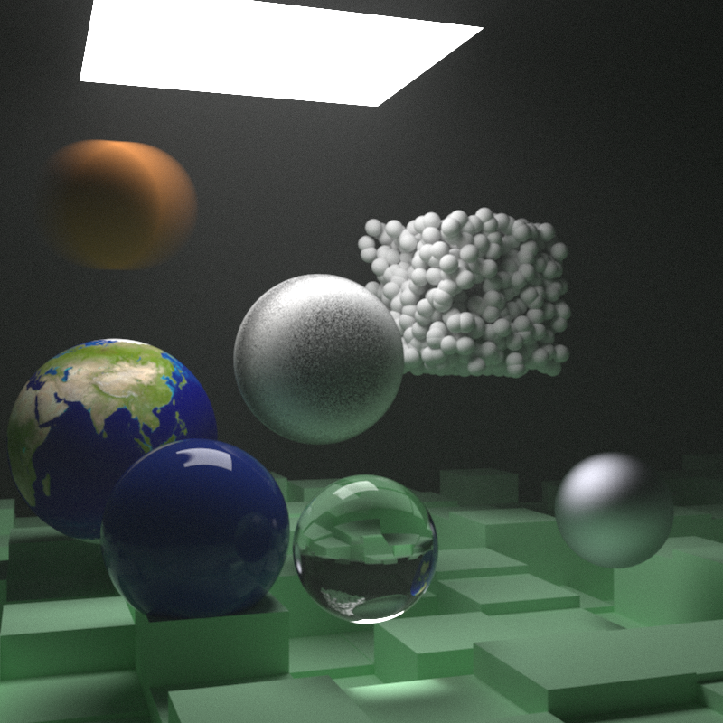

# rusty-raytracing-weekend

Following [_Ray Tracing in One Weekend_](https://raytracing.github.io/) to make a CPU raytracer but in Rust!




## Progress:
1. Completed: [_Ray Tracing in One Weekend_](https://raytracing.github.io/books/RayTracingInOneWeekend.html) - [Completed Code Here](https://github.com/stevenhuyn/rusty-raytracing-weekend/tree/7b10c8097581be7427d7b18647b07b8a451772f5)
2. Completed: [_Ray Tracing: The Next Week_](https://raytracing.github.io/books/RayTracingTheNextWeek.html)
3. Not Started: [_Ray Tracing: The Rest of Your Life_](https://raytracing.github.io/books/RayTracingTheRestOfYourLife.html)
4. Not Started: Web port with wasm using [wasm-bindgen](https://github.com/rustwasm/wasm-bindgen) and [wasm-bindgen-rayon](https://github.com/GoogleChromeLabs/wasm-bindgen-rayon) (?)

## Goals
- Learn idiomatic Rust
- Find out what happens if you're inside a perfectly spherical mirror

## Running 

Render and show in window with default sizing `400 x 225`:
```
cargo run --release
```

Render in FHD resolution, headless and save file with filename `FHD.png`:
```
cargo run --release -- -w 1920 -h 1080 -i -s -f "FHD.png"
```

See options:
```
cargo run --release -- --help
```

## Dependency breakdown
- clap - Command line interface Parser
- glam - 3D math library, using it so I didn't have to implement vec operations
- pixels - Draw our `vec<RGB value>` (pixels) to window
- winit - Cross platform window manager/event handler
- rayon - Literal black box magic that multithreads ya code
- image - Image encode/decoder, used just to encode and save our `vec<RGB value>` as a png

